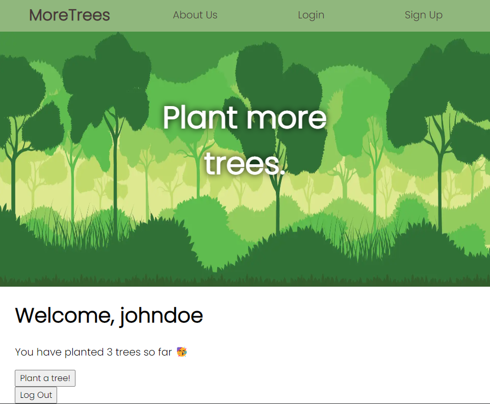

This is a [Next.js](https://nextjs.org/) project bootstrapped with [`create-next-app`](https://github.com/vercel/next.js/tree/canary/packages/create-next-app).

# MoreTrees.com

<br/>This website aims at encouraging people to become more concerned about the importance of our environment and promotes planting of trees among masses. It aims to provide a gamified challenge to keep people motivated at planting trees. 

## Getting Started

First, afteer generating the `node_modules` create a `.env.local` file in the root directory, and add two lines here:
```
SECRET_KEY = "YOUR_SECRET_KEY"
NEXT_PUBLIC_MONGODB = "YOUR_MONGODB_URL"
```
where secret key is any string you can use and mongodb url is a valid local or cloud mongodb URI.<br/>
Then, run the development server:

```bash
npm run dev
# or
yarn dev
```

Open [http://localhost:3000](http://localhost:3000) with your browser to see the result.

You can start editing the page by modifying `pages/index.js`. The page auto-updates as you edit the file.

The `pages/api` directory is mapped to `/api/*`. Files in this directory are treated as [API routes](https://nextjs.org/docs/api-routes/introduction) instead of React pages.

## Learn More

To learn more about Next.js, take a look at the following resources:

- [Next.js Documentation](https://nextjs.org/docs) - learn about Next.js features and API.
- [Learn Next.js](https://nextjs.org/learn) - an interactive Next.js tutorial.

## Contributing
Contribution can be done by solving existing issue or suggesting a bug fix/feature request via a new issue
